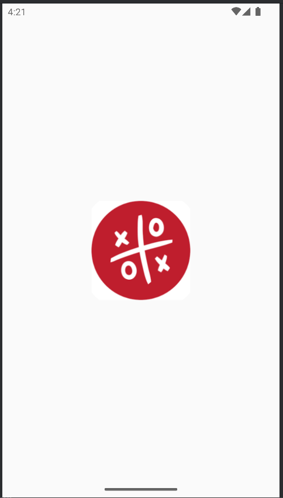
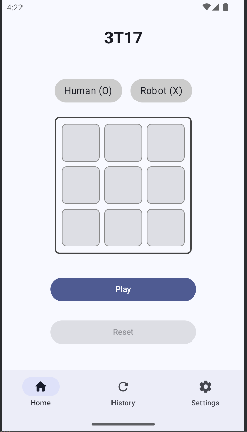
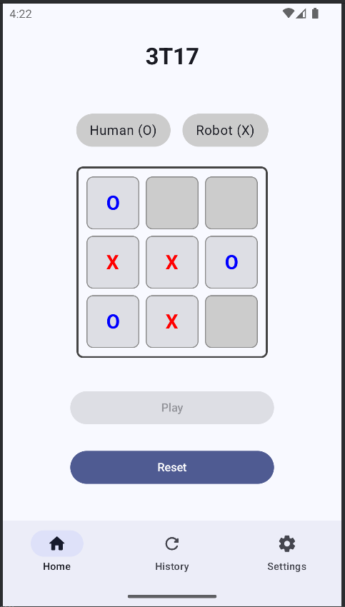
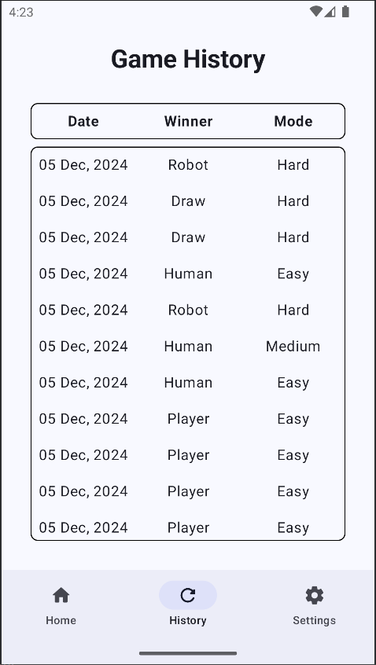
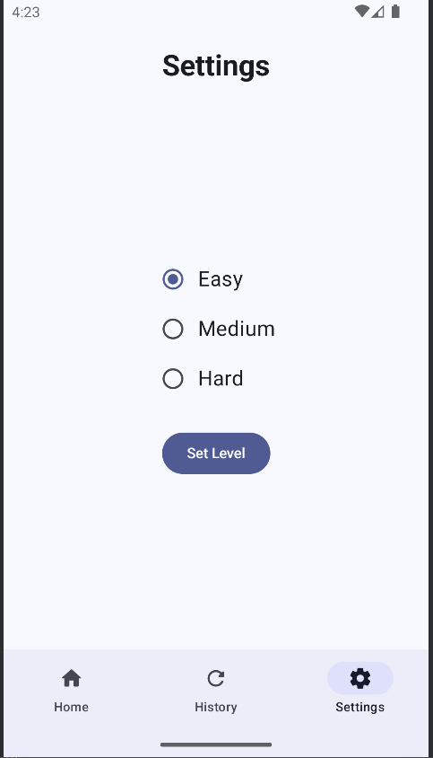

# 3T17 Game App

Project 2: Tic-Tac-Toe Game, Arizona State University, Group 17.

This project implements a simple Tic-Tac-Toe game with some key elements where the user can play against AI with 3 levels of difficulty where the AI can take perfect moves at the hardest and at the easiest it will make deliberate blunders. The games are recording into a Room database and are displayed to the user, where it shows the difficulty, winner, and time of the game. These are the foundational elements in our Tic-Tac-Toe game, we use alpha-beta pruning and a Mini-Max algorithm to allow the AI agent to determine optimal moves within the game.

Collaborators are:
1. [ShadowHead745](https://github.com/ShadowHead745)
2. [acrodi](https://github.com/acrodi)
3. [dhanush224](https://github.com/dhanush224)
4. [Prateek-Karn](https://github.com/Prateek-Karn)
5. _Deepak V_

### Screenshots below

